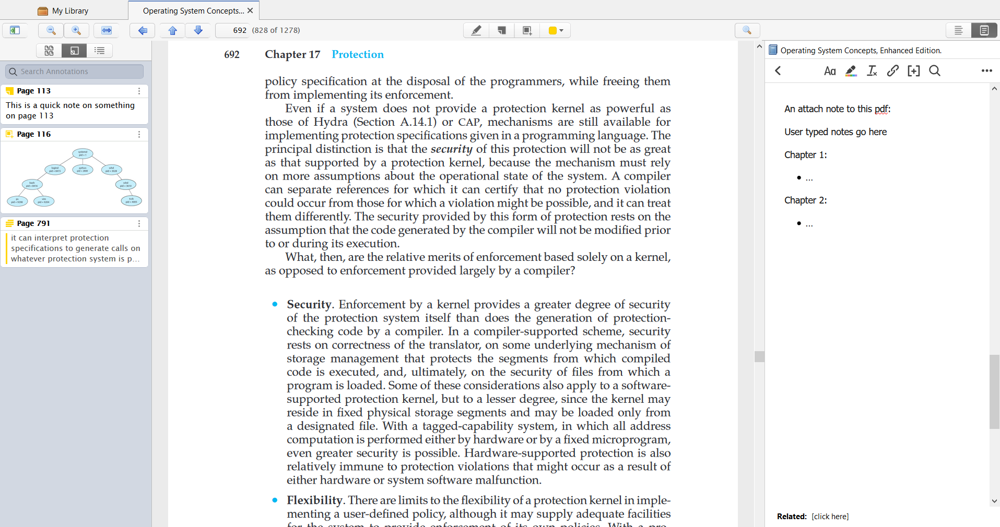

# Icons and Layout of Zotero’s PDF Reader
By: Ethan Nguyen

Published Date: 10/14/2022

Zotero is a software that helps users manage various sources (such as books, pdf files, webpages, news articles, etc.). After a user adds sources into Zotero, they can add notes to a source, manage citation information for a source, and group sources into categories and tags, among other features. 

While Zotero is marketed more towards academic researchers, I have used Zotero to just keep track of things I have read from schoolwork to random articles here and there. Recently I started using Zotero as my main platform for reading and taking notes (Zotero has an in-built pdf reader). In doing so, I discovered a couple of interesting things about Zotero’s PDF reader in regard to usability and general user experience.

Screenshot of the PDF reader:

Within the pdf reader, users are presented with a lot of buttons, none of which are labeled. For a lot of them, Zotero does a good job of taking advantage of **natural mapping** i.e. taking advantage of a link between the icon and the action that it is doing. For example, these two sets of buttons:  and .

For the first set, the icon resembles a magnifying glass, a commonly available object; taking advantage of cultural standards, users are likely to draw the link that the button on the left zooms out the page while the button on the right zooms in. The second set of icons takes advantage of a physical analogy by mapping the changing of a page with the direction that the page is scrolling; the up arrow will go to the page above the current page and the down arrow the opposite. 

There are, however, a couple of buttons where the mapping did not fit my **mental model** (how I expected the button to behave). The first of which is this leftward-facing arrow .

From cultural standards, my guess was that this button was a back button for something; perhaps going back to the main Zotero screen where all other sources are listed, or maybe going back to a previous page (which would be a redundancy of the up button). 

When navigating through the pages normally, however, clicking the back button does absolutely nothing: 

Only after playing with other forms of navigation did it become clear what the left arrow button does; when a user jumps to a page (either searching for a specific page or using the table of contents) the left arrow button gains visibility and can be used as a back button to return to the original page.

I think part of the issue with this icon was that there were no clues about the circumstances where the button would be valid; the button does gain some visibility only when it is able to be clicked, but there is no indication that it is meant for page jumps. It took some deliberate effort for me to figure out what the purpose of that button was. Regular users may just end up just ignoring this button altogether and miss out on a decently useful button.

A couple of ideas I had that might improve the usability of this button are: 
* possibly changing the icon to be more curved to take advantage of the cultural standard of an “undo” button as well as have a better mapping from the analogy of “jumping” to a page; e.g. a button similar to google docs undo button .
* maybe moving the button closer to the page search box to suggest its usage.

Another icon that is a little problematic is the magnifying glass on the right side of the screen: . The problem with this icon is that it is the same exact icon used for the page zooming just without the + and - symbols. A users' mental model could potentially link these two features and assume that this button has something to do with the zooming of the page. In actuality though, this button is for a text search.

This issue is not as problematic as the back button as once a user clicks on the icon it would immediately become clear what its purpose is. Making the icon more clear though, could help a lot with overall user experience as they would feel less of a need to purposefully check what that icon is doing.

I think an icon similar to Microsoft Edge’s CTRL-F icon () could help a lot with this. That icon is different enough from the icon used for page zooming and also has a better mapping to its text search functionality (playing on an analogy of a magnifying glass scanning for text inside a document).

The last major usability point that I discovered in my time using Zotero was where notes and annotations are located on the PDF reader. In Zotero, notes are plain text documents that the user can attach to a source while annotations are “sticky notes”, text highlights, or screenshots that all are page-specific and can only be created and viewed within the PDF reader.

In the PDF reader, notes are placed on the right panel while annotations are placed on the left: 

Looking at the other available options for each panel, it seems like the current design strongly encourages users to have a mental model of the left panel being for navigation and the right panel for user-created content. 

The two other options for the left panel are pages-by-screenshot and table of contents:

 

The other option for the right panel is to view the source info panel (where information is auto-generated but can be manually edited), the location where users can add and view tags associated with a source, and where the user can link related sources together.

For the annotation tab, using this model, there are fair justifications for placing it on either side. The justification for the left panel (where it currently is placed) is that annotations are page specific and the left panel is for jumping to specific pages. 

While I understand that justification, I would argue that moving the annotation tab to the right panel works better as it aligns with a more memorable mental model of having all content that users can edit and change be on the same side. I rarely use the table of content and the pages-by-screenshot navigation tools and often have the entire left panel collapsed and out of view. In this situation, it can take a moment to remember that when I want to see the annotations I created, that they are located on the opposite panel than the one I am constantly working with.

In conclusion, Zotero’s PDF reader does a decent job at representing a lot of different features through icons and laying out these icons in a way that fits an average user’s mental model. There are a few icon and layout decisions that didn’t align as well but overall, these issues are relatively minor and fixes are fairly simple.
