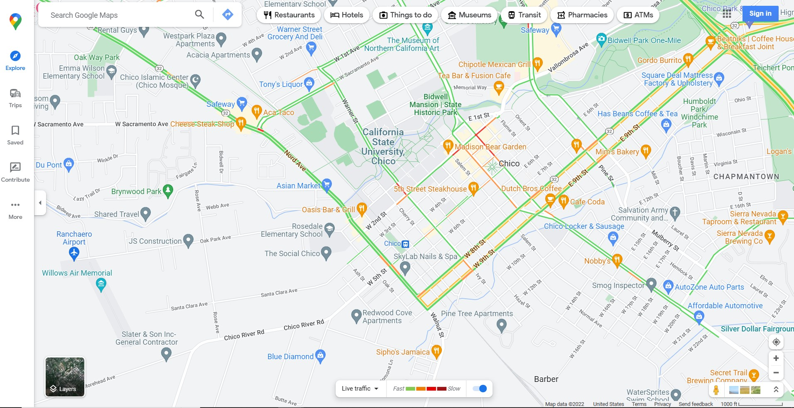
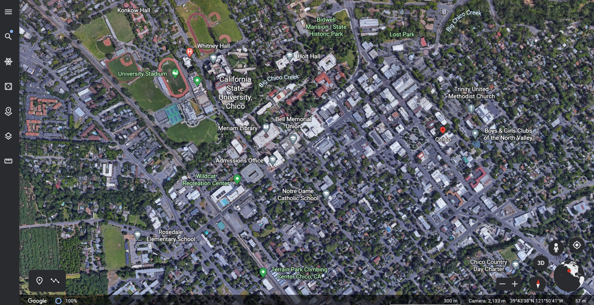

# Learnability of Google Earth Web App with Google Maps Knowledge
By: Ethan Nguyen 

Published Date: 12/15/2022

Google Earth is a software that allows users to explore the Earth through a virtual 3D rendering created from satellite images. Unlike the popular map software, Google Maps, Google Earth has less of a focus on helping users navigate from place to place, and more so on visualizing and exploring areas.

Being decently familiar with Google Maps, I personally found Google Earth to be really easy to use despite relatively little time getting familiar with its layout. This prompted the question, what exactly did Google Earth do to give me such a good impression of its learnability?

Upon closer examination, I came to believe that the borrowing of icons from Google Maps was likely one of the largest factors. Though the icons are laid out differently, the consistency across both of the platforms made it so that any user familiar with one software can correctly assume the use case of the other software.

Google Maps Website: 

Google Earth Website:

Similar icons included, the person icon (to represent how to get to street view), the plus and minus icons (to zoom in and out on the map), the target icon (to move the map to where the user is physically located) and the layers icon (to change the map view). 

A minor challenge I had with Google Earth, however, came when I used features not present in Google Maps. Google Earth has the unique feature of being able to rotate and tilt the map in 3D. I knew that this was possible as I had seen people do it before, but had some trouble initially figuring it out myself.

The first thing I did was use the button on the bottom right labeled 3D:

It appeared that I was making progress toward my goal, but that was not exactly what I wanted to do. The map clearly entered 3D mode but I still did not have control over that axis and didn’t really want the map to auto-rotate around. I then began to try different keyboard interactions. 

Click and hold with the mouse moves the map in the x, y plane as it did in 2D mode:

Right click and hold zooms in and out: 

Keyboard directional keys does the same thing as left click and hold:

Finally, I stumbled upon what I was looking for; mouse wheel click and hold:

I think part of my struggles with this feature was that the middle mouse click is not an interaction I am used to and is not commonly used in other software that I am familiar with. Many of the other key combinations that I gave a try were already being used for other purposes, so remapping them may cause more confusion to existing users than would be desired; a potential thing Google Earth could do, however, is to make help and documentation for map navigations a little bit more explicit.

Google Earth does have an embedded help bar, but it did take a while to get to the desired page. Adding the keyboard shortcuts to the top of this help bar could help a lot for new users of Google Maps.

Current help and documentation for keyboard shortcuts:

In conclusion though, I had a great experience with Google Earth’s layout; it effectively took advantage of already established user behaviors from another popular and similar product and allowed me to quickly transfer over knowledge learned.
